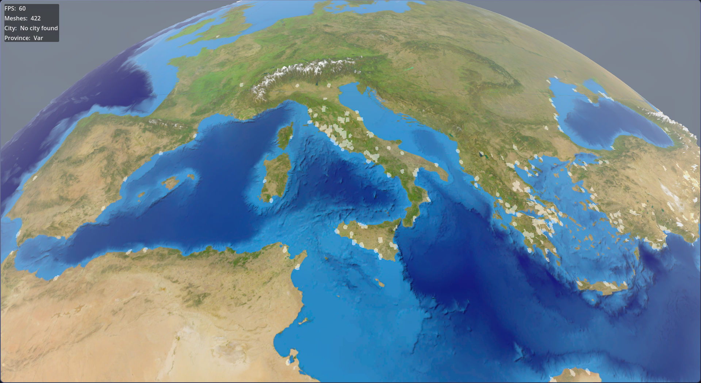

# Godot World

Godot World is an experimental C++ project built with the Godot game engine and godot-cpp bindings. Originally conceived as a strategy game where players manage an ancient civilization, the project has been paused for now.
It recreates a detailed 3D model of Earth with satellite imagery, terrain relief, ocean waves, provinces and cities.

# Preview

Here is a glimpse of the Earth simulation: 

Note: This is an unpolished prototype with some visual artifacts - very much a work in progress.

# Key Features

- Satellite Texture Mapping: High-res Earth surface from public satellite data.
- Terrain Generation: Procedural relief based on elevation data.
- Dynamic Effects: Simple wave simulations for oceans using shaders.
- Geopolitical Borders: thousands of provinces wordwide and hundreds of cities.
- C++ Integration: Core logic in C++ for performance, exposed via godot-cpp.
